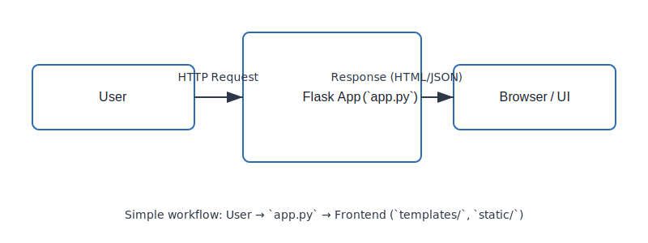
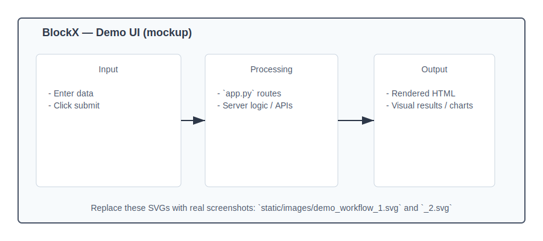

# BlockX

BlockX is a small Python web application (Flask-based) that demonstrates a lightweight UI served from `templates/` and static assets in `static/`. It appears to be a research-oriented/illustrative project with a `ReferancePaper/` folder included for reference material.

This README documents how to set up, run, and contribute to the project.

## Features

- Minimal Flask web app structure with `app.py` entry point
- Static frontend assets under `static/` (JavaScript and CSS)
- HTML templates under `templates/` (single-page UI in `index.html`)
- Research/reference material in `ReferancePaper/`

## Tech stack

- Python (3.10+ recommended)
- Flask (web framework)
- Standard HTML/CSS/JavaScript for the frontend

## Repository structure

Top-level layout (important files and folders):

- `app.py` — application entry point (starts the web server)
- `requirements.txt` — Python dependencies
- `templates/` — HTML templates (contains `index.html`)
- `static/` — static assets
	- `main.js` — frontend JavaScript
	- `styles.css` — frontend styles
- `ReferancePaper/` — supporting/reference documents
- `README.md` — this file

## Prerequisites

- Python 3.10 or newer
- Optional: `venv` for an isolated environment

## Quickstart — Local development

1. Clone the repository:

```bash
git clone https://github.com/riteshpandey2024-cyber/BlockX.git
cd BlockX
```

2. Create and activate a virtual environment (recommended):

```bash
python3 -m venv venv
source venv/bin/activate
```

3. Install dependencies:

```bash
pip install -r requirements.txt
```

4. Run the application:

```bash
python app.py
```

By default the app typically listens on `localhost:5000` (Flask default). Open your browser to http://127.0.0.1:5000/ or the address printed by the app.

If the project uses the Flask CLI instead, you can run:

```bash
export FLASK_APP=app.py
export FLASK_ENV=development
flask run
```

## Configuration

- Environment variables commonly used:
	- `FLASK_APP` — entry module (e.g., `app.py`)
	- `FLASK_ENV` — `development` or `production`
	- `PORT` — custom port (if supported by `app.py`)

Check `app.py` for any additional configuration keys (database, API keys, etc.).

## Development notes

- Frontend: modify files in `static/` and templates in `templates/`.
- Backend: `app.py` is the main place to extend routes, logic, or APIs.
- If you add new Python dependencies, update `requirements.txt` with:

```bash
pip freeze > requirements.txt
```

## Tests

This repository does not include an automated test suite by default. Consider adding `pytest` and a basic test folder (`tests/`) for future development and CI.

## Contribution

Contributions are welcome. Suggested process:

1. Fork the repository.
2. Create a feature branch: `git checkout -b feat/your-feature`.
3. Make changes and commit with clear messages.
4. Open a pull request describing your changes.

If you rely on external services or APIs, document how to obtain keys and how to configure them in environment variables.

## Reference materials

See the `ReferancePaper/` folder for research materials and supporting documents used while developing or researching the project.

## License

This project does not include a license file. If you plan to open-source it, add a `LICENSE` (for example, MIT, Apache-2.0) to clarify reuse rights.

## Contact

For questions or collaboration, open an issue or a pull request on the repository.

---

If you'd like, I can also:

- Add a `LICENSE` file (suggest MIT)
- Add a basic `Dockerfile` and `docker-compose.yml` for containerized runs
- Add a small test harness and CI workflow (GitHub Actions)

Tell me which of these you'd like me to add next.

## Demo & Screenshots

Below are illustrative demo images showing the project's workflow and a UI mockup. These are included as SVG placeholders — replace them with real screenshots if you have them.

- Workflow diagram: static/images/demo_workflow_1.svg

	

- UI mockup / demo screenshot: static/images/demo_workflow_2.svg

	

How to replace the images:

1. Add your PNG/JPEG/SVG files to `static/images/` with the same filenames, or update the image paths above.
2. Commit and push the changes; the README will display the updated images on GitHub.

