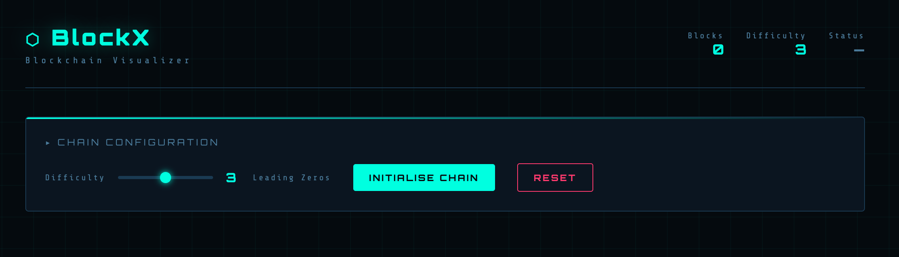
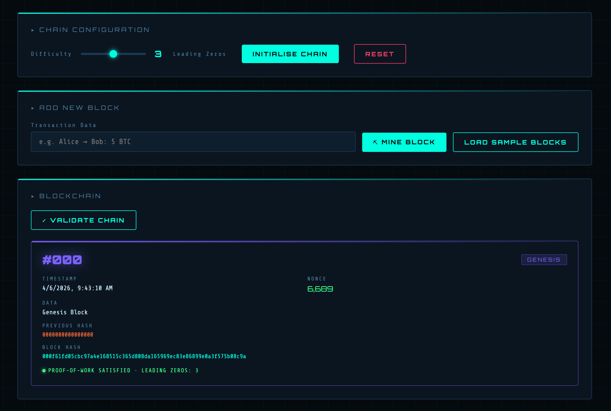
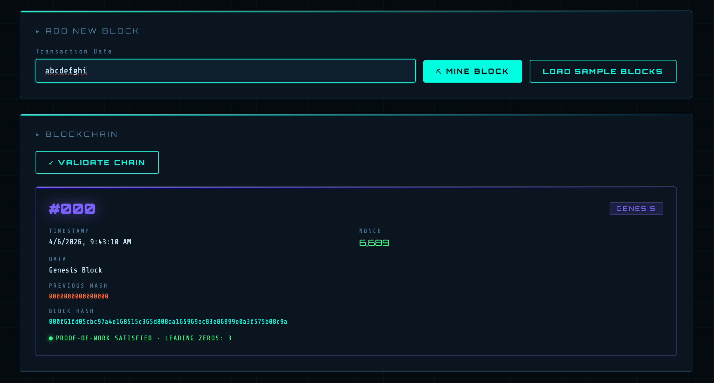
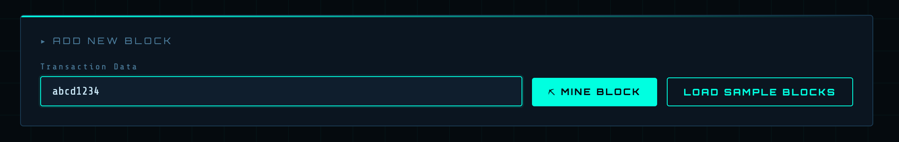
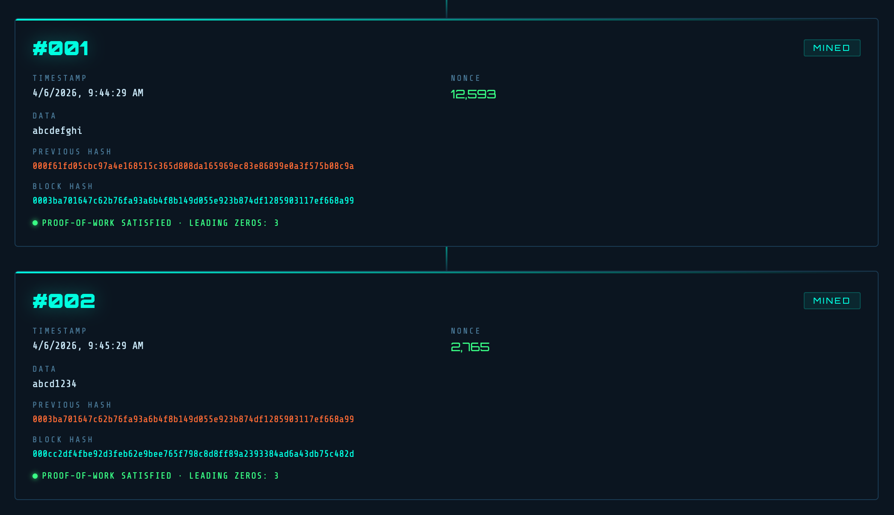
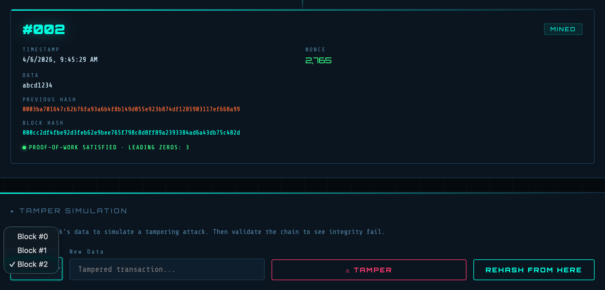
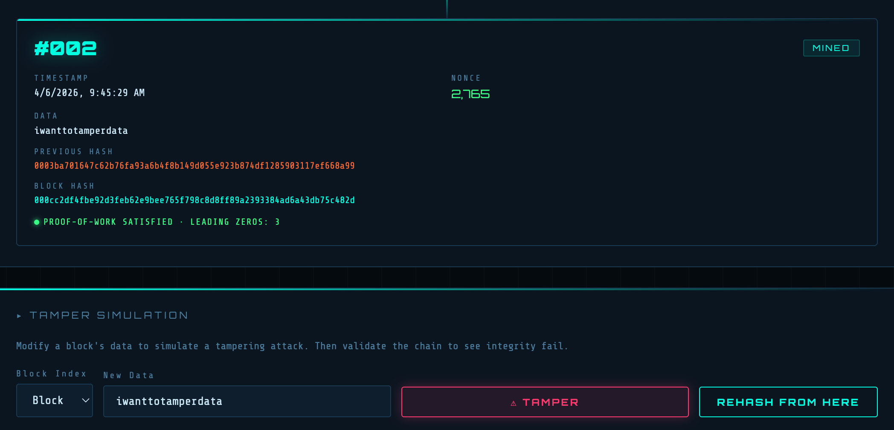
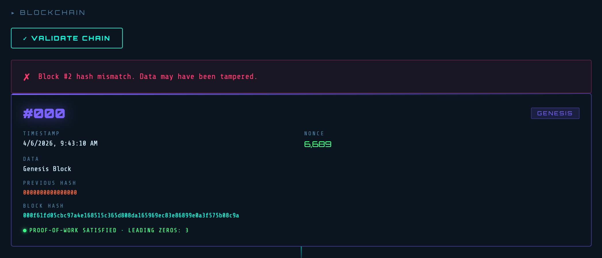
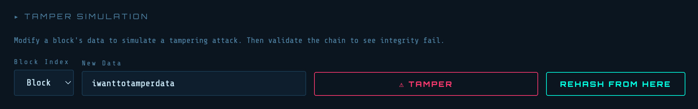
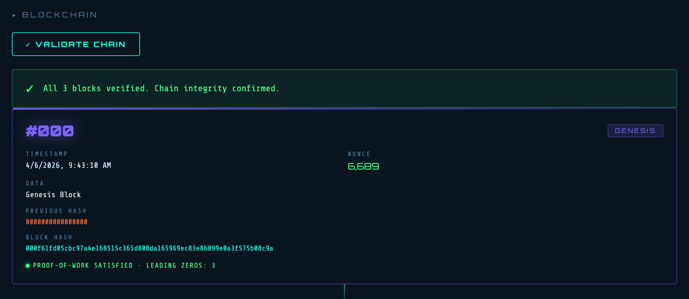

# BlockX 

BlockX is a hashing-based blockchain demonstration project that illustrates the core principles of blockchain data integrity and validation.

In this system, users can add blocks where each block contains its own hash along with the hash of the previous block, forming a secure chain. This linkage ensures that any modification (tampering) in a block disrupts the entire chain integrity.

The project demonstrates how:
- Each block is cryptographically linked using hashes  
- Tampering with data changes the block hash and breaks validation  
- The system detects inconsistencies through validation checks  
- Rehashing the chain restores integrity and revalidates the blockchain  

BlockX provides a clear and practical understanding of how blockchain ensures **data security, immutability, and integrity** using hashing techniques.

---

## 📸 System Workflow & Demonstration

### 1. Dashboard Overview

  

This is the main dashboard of BlockX where users can configure the blockchain, set difficulty level, and initialize the chain.

---

### 2. Initialize Blockchain

  

The user initializes the blockchain by setting the difficulty (number of leading zeros required for Proof-of-Work).

---

### 3. Add New Block (Input Data)

  

User enters transaction data into the input field before creating a new block.

---

### 4. Mine Block

  

After clicking **Mine Block**, the system performs Proof-of-Work and generates a valid hash with required leading zeros.

---

### 5. Blockchain After Adding Blocks

  

New blocks are added to the chain. Each block contains its own hash and the previous block’s hash, maintaining linkage.

---

### 6. Tamper Simulation

  

User modifies the data of a block to simulate a tampering attack.

---

### 7. Chain Validation Failure

  

After tampering, validation fails because the hash no longer matches, breaking the blockchain integrity.

---

### 8. Validate Chain (Before Tampering)

  

When the user clicks **Validate Chain**, the system checks all blocks and confirms that the chain integrity is valid.

---

### 9. Rehash and Restore Integrity

  

After rehashing the affected blocks, the chain becomes valid again and integrity is restored.

### 10. Chain Integrity Confirmed

  

All blocks are verified successfully, showing that no data has been modified.

---

## Key Features

### Simple and Clean Interface  
Easy-to-understand UI for beginners learning web development.

### Flask-Based Backend  
Uses Flask to manage server-side logic and routing.

### Frontend Integration  
Static files like CSS and JavaScript are organized inside the `static/` folder.

### Template Rendering  
Dynamic HTML rendering using Flask templates from the `templates/` directory.

### Organized Project Structure  
Well-structured folders for scalability and maintainability.

### Learning Support  
Includes a `ReferancePaper/` folder for additional study materials.

---

## System Workflow

1. User opens the web application  
2. Request is sent to the Flask server (`app.py`)  
3. Server processes the request  
4. HTML templates are rendered  
5. Static files (CSS/JS) are applied  
6. Output is displayed in the browser  

---

## Technologies Used

- Python  
- Flask  
- HTML  
- CSS  
- JavaScript  

---

## 🎯 Project Goal

The primary goal of **BlockX** is to provide a practical and visual understanding of how blockchain technology works, with a strong focus on **hashing, data integrity, and validation mechanisms**.

This project is designed to demonstrate the internal working of a blockchain system in a simplified and interactive way, making it easier for beginners to grasp core concepts.

### 🔍 Key Objectives

- **Understand Blockchain Structure**  
  Demonstrates how each block stores its own hash and the hash of the previous block, forming a secure chain.

- **Learn Hashing Mechanism**  
  Shows how cryptographic hashing ensures data consistency and uniqueness for every block.

- **Demonstrate Data Integrity**  
  Highlights how even a small change in block data results in a completely different hash, breaking the chain.

- **Tampering Detection**  
  Simulates real-world attacks by allowing users to modify block data and observe how validation fails.

- **Chain Validation Process**  
  Implements a validation system that checks whether all blocks are correctly linked and untampered.

- **Rehashing & Recovery**  
  Explains how recalculating hashes (rehashing) restores the integrity of the blockchain after tampering.

- **Proof-of-Work Concept**  
  Introduces mining using difficulty levels (leading zeros), helping users understand how blocks are validated in real blockchain systems.

### 🚀 Learning Outcome

By using BlockX, users will gain a clear understanding of:

- How blockchain maintains **immutability**  
- Why **hash linking** is critical for security  
- How **tampering is detected instantly**  
- The importance of **validation and consensus concepts**  

Overall, BlockX serves as a **hands-on educational tool** for learning the foundational principles of blockchain in a simple and interactive environment.

## Developer - Ritesh Pandey

---

